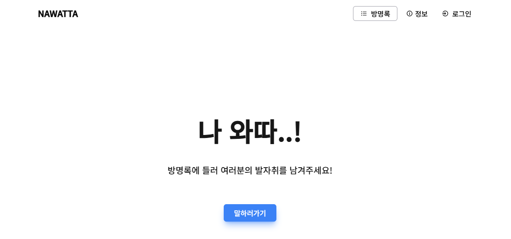

    
    <h1>Nawatta</h1>
    
나 왔다! 방명록 프로젝트입니다. 간단한 소셜로그인, 자신의 존재를 알리는 메시지를 남겨주세요!

    
     
    

---

    

---

## 🌟 주요 기능
- 📝 **소셜로그인 기능 구현**: Google, GitHub 등 다양한 소셜 로그인 지원.
- 💬 **방명록 메시지 작성 및 공유**: 사용자들이 자신의 메시지를 남기고 공유 가능.
- 📱 **모바일 반응형 디자인**: 모든 디바이스에서 최적화된 UI 제공.

---

## 🛠 기술 스택

| 카테고리            | 기술 스택                                                                                       |
|---------------------|------------------------------------------------------------------------------------------------|
| **Frontend**        |    |
| **Styling**         |  |
| **Authentication**  |           |
| **Database**        |  →  →  |
| **Deployment**      |                    |

---

    <h3>✨ 저의 첫 웹 프로젝트를 즐겨주세요! ✨</h3>

